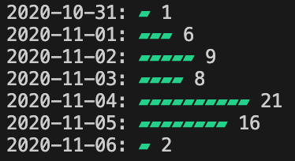

# github-contributions-CLI
A command line tool for checking your recent contributions on GitHub

<p align="left">
  
</p>

## Setup (Optional)
To be able to call the script without specifying your GitHub username every time, add it to the `config.ini`.

## Usage
If the configuration file has been set up as described above, the script works by simply running
```
python3 githubContributions.py
```
To get more info about usage, run the script with the `-h` flag.
